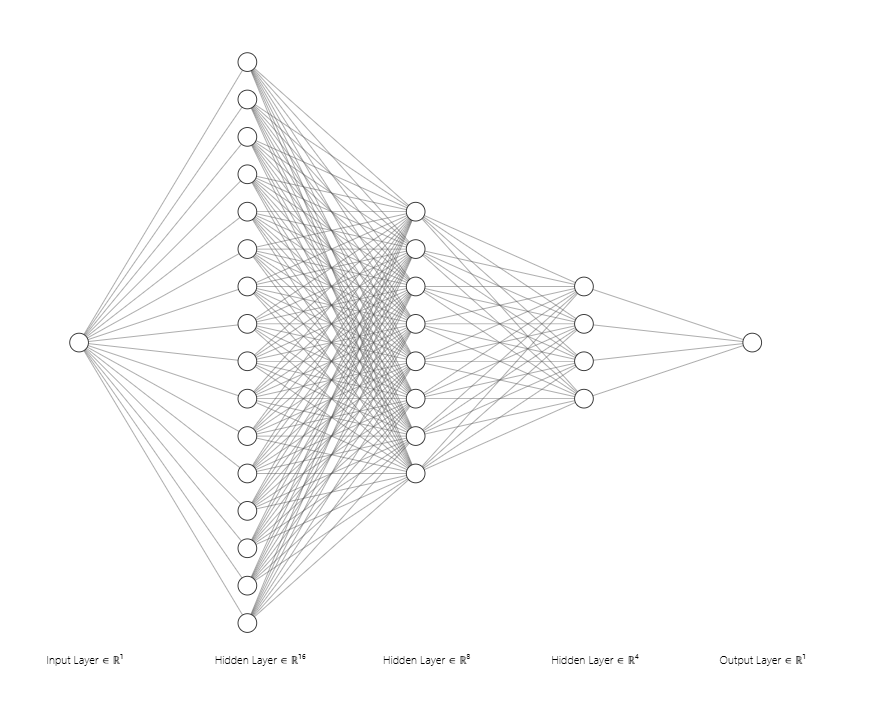
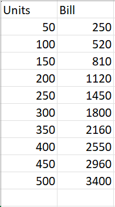
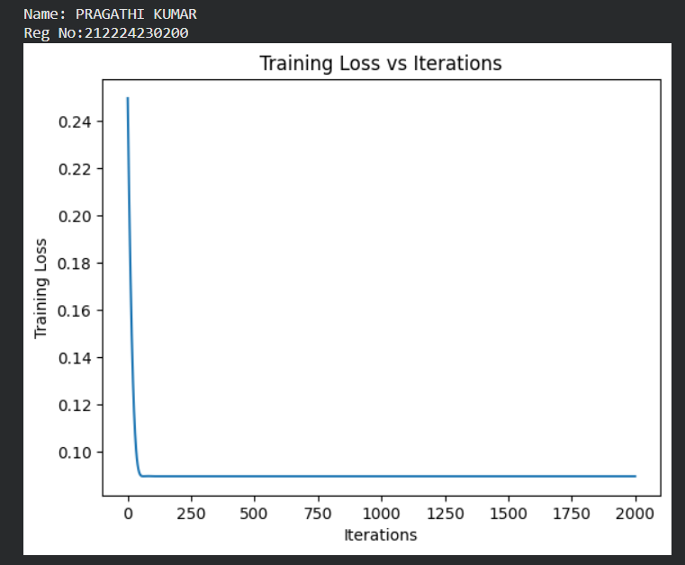
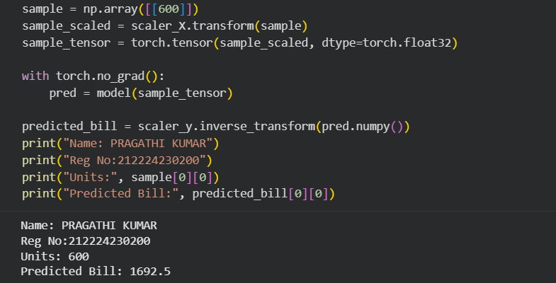

# Developing a Neural Network Regression Model

## AIM

To develop a neural network regression model for the given dataset.

## THEORY
The objective of this experiment is to develop a neural network regression model using a dataset created in Google Sheets with one numeric input and one numeric output. Regression is a supervised learning technique used to predict continuous values. A neural network is chosen because it can effectively learn both linear and non-linear relationships between input and output by adjusting its weights during training.

The model is trained using backpropagation to minimize a loss function such as Mean Squared Error (MSE). During each iteration, the training loss is calculated and updated. The training loss vs iteration plot is used to visualize the learning process of the model, where a decreasing loss indicates that the neural network is learning properly and converging toward an optimal solution.


## Neural Network Model




## DESIGN STEPS

### STEP 1:

Loading the dataset

### STEP 2:

Split the dataset into training and testing

### STEP 3:

Create MinMaxScalar objects ,fit the model and transform the data.

### STEP 4:

Build the Neural Network Model and compile the model.

### STEP 5:

Train the model with the training data.

### STEP 6:

Plot the performance plot

### STEP 7:

Evaluate the model with the testing data.

## PROGRAM
### Name:PRAGATHI KUMAR
### Register Number: 212224230200
```
class NeuralNet(nn.Module):
    def __init__(self):
        super().__init__()
        self.fc1 = nn.Linear(1, 16)
        self.fc2 = nn.Linear(16, 8)
        self.fc3 = nn.Linear(8, 4)
        self.fc4 = nn.Linear(4, 1)

    def forward(self, x):
        x = torch.relu(self.fc1(x))
        x = torch.relu(self.fc2(x))
        x = torch.relu(self.fc3(x))
        x = self.fc4(x)
        return x


# Initialize the Model, Loss Function, and Optimizer
model = NeuralNet()
criterion = nn.MSELoss()
optimizer = optim.Adam(model.parameters(), lr=0.01)

def train_model(PRAG_brain, X_train, y_train, criterion, optimizer, epochs=2000):
    losses = []

    for epoch in range(epochs):
        optimizer.zero_grad()
        output = PRAG_brain(X_train)
        loss = criterion(output, y_train)
        loss.backward()
        optimizer.step()
        losses.append(loss.item())

    return losses


```
## Dataset Information




## OUTPUT

### Training Loss Vs Iteration Plot




### New Sample Data Prediction




## RESULT
Thus the neural network regression model is developed using the given dataset.
